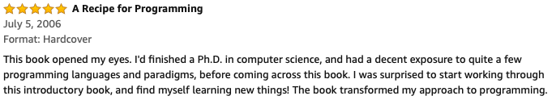

# How to Design Programs

Working through the [How To Design Programs](https://www.htdp.org) exercises as I read the book.

From somewhere on the Internet:

---

---

I was initially watching Gregor Kiczales' accompanying [playlists](https://www.youtube.com/channel/UC7dEjIUwSxSNcW4PqNRQW8w) concurrent with the material, which were good and short enough to finish before the corresponding material in the book.

HTDP incrementally teaches a pragmatic understanding of recursion and an intuition behind why the structure of the code follows the structure of the data definitions and downward. Classifies natural, mutual, structural, and generative recursions, explaining the why/what/when/etc of each.

See also:
https://www.edx.org/course/how-code-simple-data-ubcx-htc1x
https://www.edx.org/course/how-code-complex-data-ubcx-htc2x
